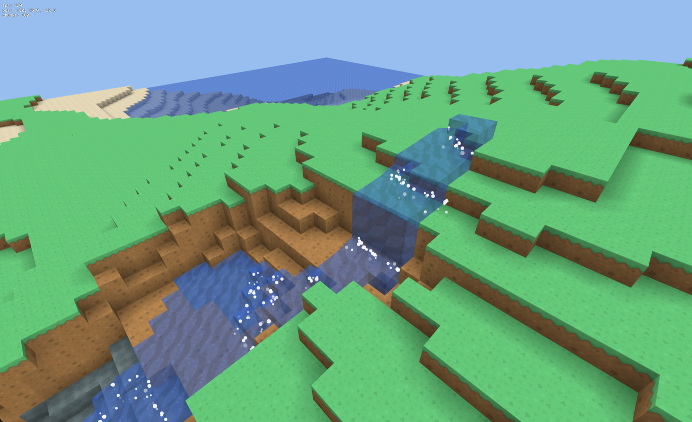

# mc_clone_fable5

Fable5 の能力テストのためにマイクラのクローンを行った。今までのモデルが越えられなかった、水の動きの実装を中心に確かめた。

## 開発の記録(動画・開発順)

クリックすると GitHub 上のプレイヤーで再生されます。

1. [mc_fable.mov](movies/mc_fable.mov)
2. [mc_fable_water_anim.mov](movies/mc_fable_water_anim.mov)
3. [mc_fable_water2.mov](movies/mc_fable_water2.mov)
4. [mc_fable_waterfall.mov](movies/mc_fable_waterfall.mov)
5. [mc_fable_waterfall2.mov](movies/mc_fable_waterfall2.mov)

## テクスチャのライセンス

`textures/` のブロックテクスチャは [Kenney Voxel Pack](https://kenney.nl/assets/voxel-pack) のタイルを使用しています(水タイルのみ模様のコントラストを加工)。

- ライセンス: [CC0 1.0](https://creativecommons.org/publicdomain/zero/1.0/)(パブリックドメイン)
- 作者: [Kenney](https://kenney.nl/)
